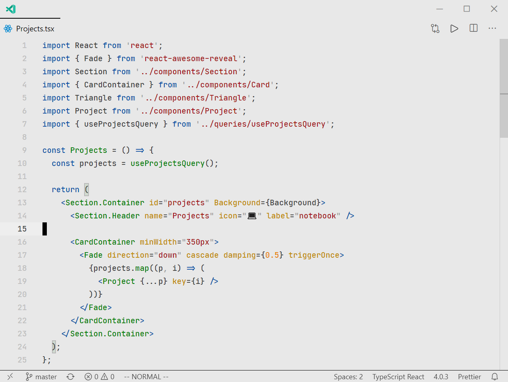

# Morning Coffee

    

Morning Coffee is a light vscode theme based on the Syntax theme, but with several changes to increase readibility. This theme has been given special care towards the use of web development.

Enjoy your Morning Coffee! ☕ 

## Language Support
> Other languages may look great as well, but they have not been manually configured like the ones below.
- Javascript (JSX/TSX included)
- HTML5/CSS3
- Python
- SQL
- C/C++